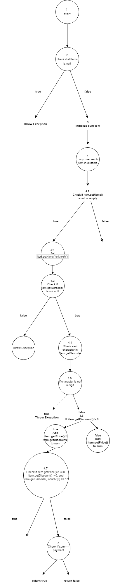

# SI_2024_lab2_143190

Христијан Јорданов, индекс 143190

## Contron Flow Graph

CFG https://drive.google.com/file/d/1uDec4zSs8N29aCv4xGvigUYoY6BWHYI7/view?usp=sharing

## Цикломатска комплексност

Комплексност = E - N + 2\*P = 9
E - број на ребра (20)
N - број на јазли (27)
P - број на излезни точки на графот (8)

20 - 27 + 2\*8 = 9

## Тест случаи според Еvery Branch критериум

1. `testAllItemsNull`: Го тестира сценариото каде што листата `allItems` е null и треба да фрли `RuntimeException`.
2. `testItemBarcodeNull`: Го тестира сценариото каде што баркодот на некој артикл е null и треба да фрли RuntimeException.
3. `testInvalidBarcodeCharacter`: Го тестира сценариото каде што баркодот на некој артикл содржи невалиден карактер и треба да фрли RuntimeException.
4. `testItemNameNullOrEmpty`: Го тестира сценариото каде што името на некој артикл е `null` или празно, и проверува дали тоа се поставува на "unknown".
5. `testItemWithDiscount`: Го тестира сценариото каде што артиклот има попуст и проверува дали цената со попуст е правилно пресметана.
6. `testItemWithoutDiscount`: Го тестира сценариото каде што артиклот нема попуст и проверува дали цената е правилно додадена на сумата.
7. `testDiscountedItemPriceGreaterThan300`: Го тестира сценариото каде што цената на артиклот е поголема од 300, има попуст и баркодот почнува со '0', и проверува дали 30 се одземаат од сумата.
8. `testSumLessThanOrEqualPayment`: Го тестира сценариото каде што сумата е помала или еднаква на плаќањето, очекувајќи функцијата да врати "true".
9. `testSumGreaterThanPayment`: Го тестира сценариото каде што сумата е поголема од плаќањето, очекувајќи функцијата да врати "false".
10. `testSumEqualToPayment`: Го тестира сценариото каде што сумата е точно еднаква на плаќањето, очекувајќи функцијата да врати "true".

Овие тестови ги покриваат сите гранки на функцијата `checkCart`

## Тест случаи според Multiple condition критериум

### можни комбинации на вредностите на трите услови:

`item.getPrice() > 300`
`item.getDiscount() > 0`
`item.getBarcode().charAt(0) == '0'`

### Комбинации на Услови

1. `item.getPrice() > 300: true / false`
2. `item.getDiscount() > 0: true / false`
3. `item.getBarcode().charAt(0) == '0': true / false`

Комбинирајќи ги овие три услови, имаме вкупно
2^3 = 8 можни комбинации.

### Сите комбинации

1. false && false && false
2. false && false && true
3. false && true && false
4. false && true && true
5. true && false && false
6. true && false && true
7. true && true && false
8. true && true && true

## Објаснување за напишаните unit tests

    item.getPrice() > 300
    item.getDiscount() > 0
    item.getBarcode().charAt(0) == '0'
